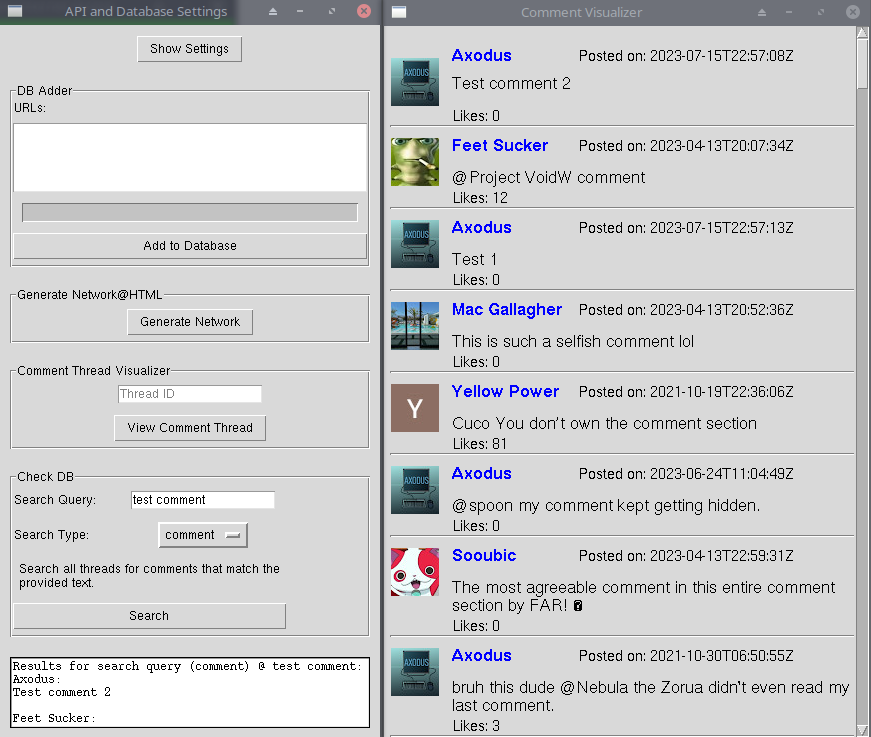
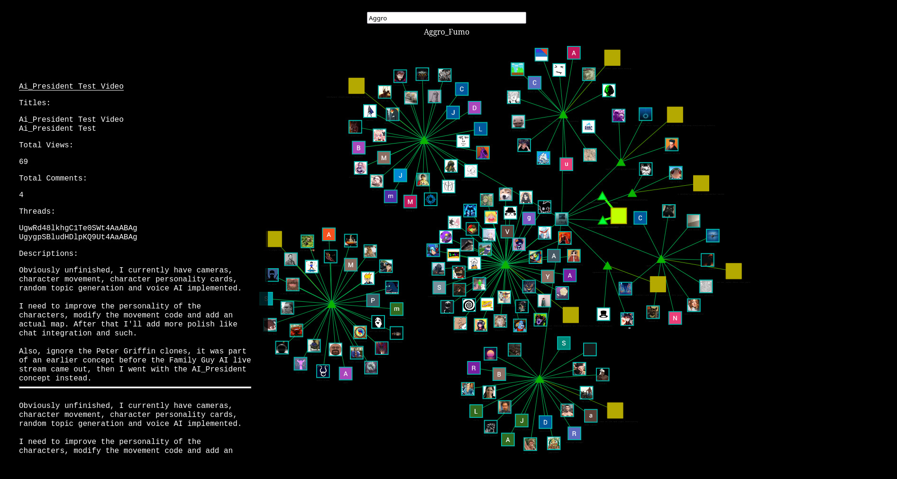

# Youtube Thread Database
The YouTube Comment Database is a Python application that serves as a tool for collecting and visualizing data from YouTube videos, comments, users, and thread interactions. The application interacts with the YouTube Data API to fetch information about videos, comments, and user profiles.

The process starts with setting up the necessary configurations for the YouTube API and database connection. These configurations include the API key and postgres database credentials, which are stored in a settings file. The application allows users to enter their API key and database information via a Tkinter-based graphical user interface.

The interface has three main sections, each catering to a specific functionality: the ADDER, CHECKER, and VIEWER.
1. The DB Adder allows you to input a list of youtube thread links, or the direct id value and the UI will add them all to the DB respecting the wait time you've set between requests.
2. The DB Checker allows you to search your Postgres DB in various different ways, the UI explains the various methods you have in-detail, the comment search-type opens up a youtube comment visualizer.
3. The Viewer is two seperate sections, the thread visualizer, and the network generator, the thread visualizer creates a youtube comments visualizer inside the tkinter UI, the network generator will be explained more below.

The core functionality of the application involves collecting data from three main tables: Users, Threads, and Videos. The data is fetched from the database and formatted into dictionaries for further processing.

For Users, the application retrieves details such as the user's channel ID, profile pictures, usernames, thread IDs, descriptions, and custom colors (if set). The user information is used to create nodes in a network visualization.

For Threads, the application fetches thread IDs, video IDs, descriptions, tags, and associated channel IDs. These details are used to create nodes and edges in the network visualization, showing the connections between threads and users.

For Videos, the application collects data like video IDs, titles, descriptions, comment counts, views, and associated thread IDs. The video information is also used to create nodes and edges in the network visualization, demonstrating the relationships between videos, threads, and users.

To enhance the network visualization, the application assigns colors and custom shapes to nodes based on user-defined colors or default color schemes. Additionally, the network edges are colored to represent different interactions between nodes, such as user-to-thread or video-to-thread connections.

To optimize the visualization process, the application uses the Vis.js library, which provides interactive network visualizations. The generated visualization is saved in an HTML file for easy sharing and viewing.

An optional feature of the application allows users to enable or disable caching of user profile pictures. When enabled, the application downloads and stores user profile pictures locally for improved performance and offline use. If disabled, the application uses the web version of profile pictures directly from YouTube.

The YouTube Comment Database is a versatile and user-friendly tool that enables users to explore and understand the relationships between YouTube videos, comments, users, and threads through a visual network representation. The collected data can be used for various analytical and research purposes related to YouTube interactions and user engagement and you'll never have to worry about your comments ever being deleted.

# To do
* Set and view user custom description/color/shape
* A time-scheduled process that automatically checks up on threads and updates and alerts you to changes
* Browser plugin to automatically import threadIDs that you interact with (step 1. learn how to create browser plugins)
* Write a set-up guide
* Test for bugs